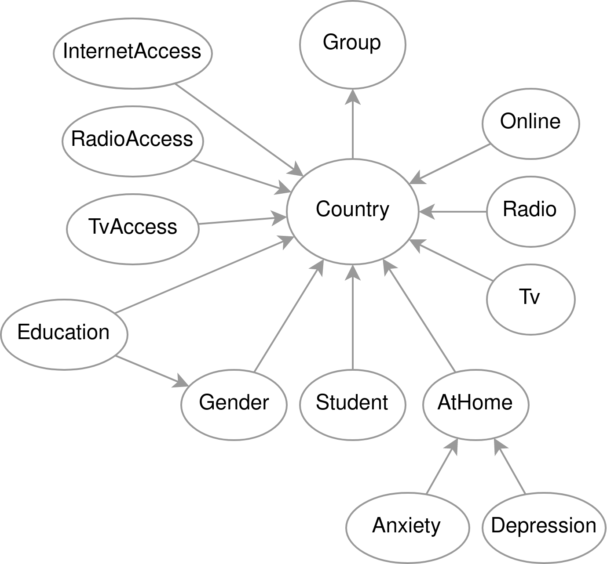

# COVID-19 Mental health analysis based on Bayesan Network

Simple analysis on data provided by UNESCO and UNICEF[1] on distant learning measures implemented all over the world.
The data has been integreated with findings by Lyubetsky et al.[2] on the effect of distant learning measures on students mental health conditions.
The analysis has been performed with the use of the [`pgmpy`](https://github.com/pgmpy/pgmpy) library using Bayesan Networks.

The analysis was perfomed as part of the [Fundamentals of Artificial Intelligence and Knowledge Representation](https://www.unibo.it/en/teaching/course-unit-catalogue/course-unit/2020/446566) exam, more information can be found on [report.pdf](./report.pdf).

[1] https://covid19.uis.unesco.org/data  
[2] Lyubetsky, N., Bendersky, N., Verina, T., Demyanova, L., and Arkhipova, D. IMPACT of distance learning on student mental health in the COVID-19 pandemic. E3S Web Conf. 273 (2021), 10036
